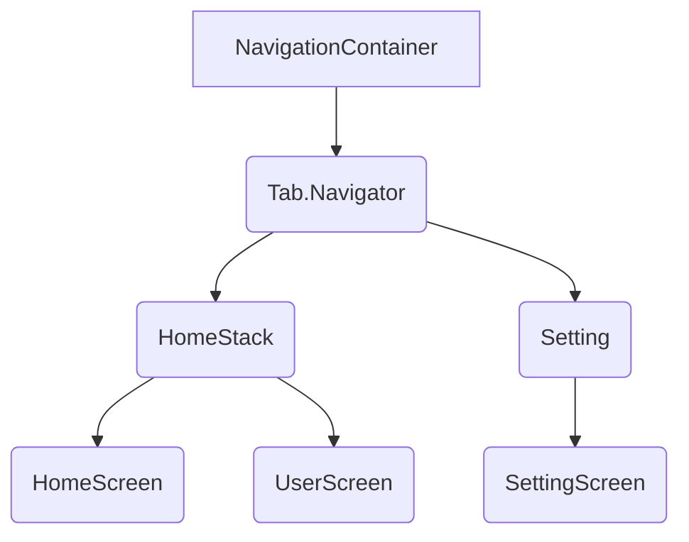

# React Navigationサンプル

React Navigationを使用したサンプルアプリです。このアプリでは、ホーム画面、ユーザー画面、設定画面の3つの画面があり、ボトムタブナビゲーションで切り替えることができます。

## インストールと実行方法

このアプリを実行するには、プロジェクトをクローンして必要なパッケージをインストールし、Expo CLIを使用して実行する必要があります。

```bash
git clone https://github.com/example/react-navigation-sample.git
cd react-navigation-sample
npm install
npm start
```

アプリを実行するにはExpo CLIが必要です。もしインストールされていない場合は、以下のコマンドでインストールしてください。

```bash
npm install -g expo-cli
```

## コンポーネントの説明

このアプリでは、以下のコンポーネントが含まれています。

- NavigationContainer
- createBottomTabNavigator
- createNativeStackNavigator

### NavigationContainer

ナビゲーションを設定するために使用される、React Navigationのトップレベルのコンポーネントです。

### createBottomTabNavigator

ボトムタブナビゲーションを作成するために使用される、React Navigationのコンポーネントです。

### createNativeStackNavigator

スタックナビゲーションを作成するために使用される、React Navigationのコンポーネントです。

## コンポーネントの構成

以下のMermaid記法で、このアプリのコンポーネントの構成を表します。

